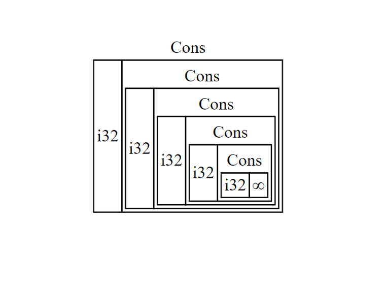
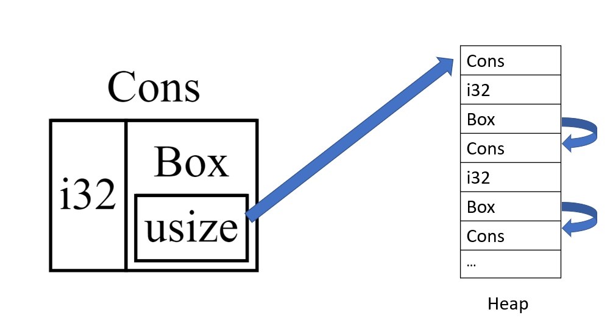

In this project, We use *TypeScript* to implement a small subset of *Rust*.

Usage
=====

To build,

``` {.}
$ git clone https://<url>/x-slang.git
$ cd x-slang
$ yarn
$ yarn build
```

To add \"x-slang\" to your PATH, build it as per the above
instructions, then run

``` {.}
$ cd dist
$ npm link
```

If you do not wish to add \"js-slang\" to your PATH, replace \"js-slang\" with \"node dist/repl/repl.js\" in the following examples.

To try out *Rust* in a REPL, run

``` {.}
$ js-slang 'fn main(){
>>     println!(\"Hello world!\")
>> }'
```

Note: Add  `\` in front of `"` since it is inside a string.

If you want to run a project in a file, run

```
$ js-slang '$path/to/file_name'
```


# Parser of Rust

We use the online source of [grammar-v4/Rust](https://github.com/antlr/grammars-v4/tree/master/rust).

The grammar for the calculator language is defined in [src/Rust/RustParser.g4](./src/Rust/RustParser.g4) as an ANTLR Grammar, and the other files in `./src/Rust/` are generated from this file using the `antlr4ts` rule (i.e `yarn run antlr4ts`) defined in [./package.json](./package.json):

```json
// file: package.json
{
  // ...
  "scripts": {
    // ...
    "antlr4ts": "antlr4ts -visitor ./src/lang/Rust.g4"
  }
  // ...
}
```


The [src/parser/parser.ts](./src/parser/parser.ts) module then imports and invokes the ANTLR4 generated parser. 

We then map the ANTLR parse tree into a simplified AST for further processing using the auto-generated ANTLR visitor classes.


# Type Checker of Rust


# Interpreter of Rust

We use *TypeScript* to interpret the *Rust* program. 

The structure of the interpreter is not well-designed. Some of the errors that should be checked by the type checker are included in the interpreter. 

PS: Remember to run your program in the `main` of function.

## `println!` Function

You can use the `println!` function of Rust to print in the terminal. 

````rust
fn main(){
     println!("Hello world!")
}
````

(As we describe above, remember to add a `\` in front of  each `"`  in order to run it in terminal)

To print out the value of a variable, 

```rust
fn main(){
    let mut a:bool = true;
    println!("{}",a);    
}
```

The value of variable `a` will replace the place of `{}` in the string.

For more detail, see line 1250 in [src/interpreter/interpreter.ts](./src/interpreter/interpreter.ts), which is a part of *builtin_evaluators*.


## Boolean, Integer, Float

These types shares the same logic basically.

An example of Boolean type:

```rust
fn main(){
    let mut a:bool = true;
    println!("{}",a);    
}
```


## Array, Tuple

An array object owns a set of items with the same type. 

Example:

```rust
fn main(){
    let a = [1, 2, 3, 4, 5];
    println!("{}",a[2]);
}
```


An array object owns a set of items that might have different types.

Example:

```Rust
fn main(){
    let x: (i32, f64 = (500, 6.4;
    println!("{}",x.1);
}
```


## Struct

Example:

```rust
fn main(){
    struct Point {x: i32, y: i32}
    let p = Point {x: 10, y: 11};
    println!("{}",p.x);
}
```

We store the property of `struct`  declaration as an array in the environment. When we create a `struct` object,  we regard it as a function call. To store the values of properties, we store them in the array in the order of the property array of the `struct` declaration.


##  if-else

Example:

```rust
fn main(){
    let x;
    let number=6;
    if number < 5 {
        x=4;
    } else if number >7 {
        x=3;
    } else {
        x=2;
    }
    println!("{}",x);
}
```

 For more details, see function *evaluateIfStatement* in  [src/interpreter/interpreter.ts](./src/interpreter/interpreter.ts)


## Loops

We implement three kinds of loops: *loop*, *while* and  *for*


Example of *loop*

```rust
fn main(){
    let mut counter = 0;
    loop {
        counter = counter + 1;
        println!("{}",counter);
        if counter == 10 {
            println!("Finish at {}",counter);
            break;
        }
    }
}
```


Example of *while*

```rust
fn main(){
    let mut number = 3;
    while number != 0 {
        number = number - 1;
        println!("{}",number);
    }
}
```

In our implementation, *loop* will be regarded as a *while* loop where the expression of the condition always return true. For more details, see function *evaluateWhileStatement* in  [src/interpreter/interpreter.ts](./src/interpreter/interpreter.ts).


Example of *for*

```rust
fn main(){
    for number in 1..5 {
        println!("number is {}", number);
    }
}
```

For more details, see function *evaluateForInStatement* in  [src/interpreter/interpreter.ts](./src/interpreter/interpreter.ts).


## Function

```rust
fn f(x: i32,y: i32) -> i32 {
    let a = 5; 
    x+y+a
}
fn main(){
    let a = f(1,2);
    println!("{}",a);
}
```

When we declare a function, we store the body of the function in the environment and prebuild a closure with all the parameters without their values. For more details, see function *declareFunction* in  [src/interpreter/interpreter.ts](./src/interpreter/interpreter.ts).

When we call a function, we use the prebuilt closure and assign each parameter with its value. For more details, see function *evaluateCallExpression* in  [src/interpreter/interpreter.ts](./src/interpreter/interpreter.ts).


## Reference

Example:

```rust
fn main(){
    let a = 3;
    let b = &a;
    println!("{}",*b);
}
```

The variable will store the variable it points to in the environment.


There are two types of references: mutable reference and immutable reference. You can change the value of the variable it points to through mutable reference.

Example:

```rust
fn main(){
    let mut s = 5;
    let a = &mut s;
    *a=1;
    println!("{}",s);
}
```


You can do pass-by-reference by using the reference type.

Example:

```rust
fn change(reference: &mut i32) {
    *reference = 6;
}
fn main(){
    let mut s = 5;
    println!("s is {}",s);
    change(&mut s);
    println!("s is {}",s);
}
```


### Rules for Reference

The first rule is that one variable can only have one type of reference. In other words, we cannot have a mutable reference and an immutable reference pointing to the same variable.

Example:

```rust
fn main(){
    let mut s = 5;
    let r1 = &s; 
    let r2 = &mut s; // error
    println!("{}, {}", r1, r2);
}
```

  

The second rule is that we cannot have two mutable reference pointing to the same variable.

Example:

```rust
fn main(){
    let mut s = 5;
    let r1 = &mut s;
    let r2 = &mut s;// error
    println!("{}, {}", *r1, *r2);
}
```


This is an example that is allowed:

```rust
fn main(){
    let mut s = 5;
    {
        let r1 = &s; // allowed
        let r2 = &s;
        println!("{} {}",*r1, *r2);
    };
    let r3 = &mut s; // allowed
    println!("{}",*r3);
}
```


To achieve these two rules, when there is a variable `a`  pointing to `b`, we store the reference type(`&` or `&mut`) and the variable name(i.e. `a`) as the properties of variable `b`. And each time the program goes out of the current scope, it will update the reference information if there is some variable declared in the environment pointing to some variable not in the local scope. For more details, see functions *updateVariableReferenceByName* and *setVariableReferenceByName* in  [src/interpreter/interpreter.ts](./src/interpreter/interpreter.ts).


### Return a Reference

For functions returning a reference type, they cannot return a reference pointing to a local variable.

```rust
fn reference()->&i32{
    let a=1; 
    &a
} 

fn main(){
    let r = reference(); // error
}
```


If we return some reference, the interpreter will check whether it returns a reference to a local variable. For more details, see function *evaluateCallExpression* in  [src/interpreter/interpreter.ts](./src/interpreter/interpreter.ts).


## *Box* Pointer

We implement `Box` pointer, one of smart pointer type. It will allocate the value it points to on the heap, instead of some place in the environment.

Examples:

```rust
fn main(){
    let a = Box::new(3);
    println!("{}",*a);
}
```

```rust
fn main(){
    let a = Box::new([1,2]);
    println!("{}",(*a)[1]);
}
```

 ```rust
 fn main(){
     struct Point {x: i32, y: i32}
     let p = Point {x: 10, y: 11};
     let bp = Box::new(p);
     println!("{}",(*bp).x); 
 }
 ```

In our implementation, we use some 'fake' representation of the call expression of `Box`. We just regard `Box::new` as a built-in function of *Rust*(see *builtin_evaluators* in  [src/interpreter/interpreter.ts](./src/interpreter/interpreter.ts)). If you want to add some feature related to `new`, you could change a more meaningful way to represent the call expression of `Box`. 


We can return the *Box* pointer by a function

```rust
fn f()->Box<i32>{
    let a = Box::new(1); 
    a
} 
fn main(){
    let b = f(); // allowed
    println!("{}",*b);
}
```


We can use *Box* pointer to define some recursive data type.

Invalid example:

```rust
enum List {
    Cons(i32, List),//error
    Nil,
} 

fn main(){
    let list = List::Cons(1,Nil); 
}
```

Valid example:

```Rust
enum List {
    Cons(i32, Box<List>), //allowed
    Nil,
} 
fn main(){
    let list = List::Cons(1, Box::new(List::Cons(2, List::Nil)));
}
```


This is the example provided by the official Rust learning reference book called [The Rust Programming Language](https://doc.rust-lang.org/book/ch15-01-box.html). The reason why we need it is illustrated by the figure below.




​													Figure 1: the structure of the invalid example



​														Figure 2: the structure of the valid example


*Rust* avoid pushing some object with infinite size into the stack to protect the memory. So we need this alternative definition of the recursive object.

We just implement the `enum` part which is used in this example. However, we did not exactly implement the `enum` type or the way to access the value of the link list. 


## Environment and Heap

To store the variables and represent the rust environment, we use a interface struct of the *TypeScript* (see *Frame* in  [src/type/type.ts](./src/type/type.ts)).

We use a tuple to represent  the heap of *Rust*. The properties of the heap are included in *Context* structure (see *Context* in  [src/type/type.ts](./src/type/type.ts)). Each 'bit' of the heap(i.e. each item of the tuple) is an integer. The meaning  of the bit at each position of the node is defined at the beginning of  [src/interpreter/interpreter.ts](./src/interpreter/interpreter.ts). Each node has at least 6 items. The first five of them are the node type, the node size, the flag for garbage collection, and the offset of the first and last children of the node. 

For the node of a single value object(i32, f32, mutable/immutable reference), the sixth item is the value of the object. The offset of the first child is 0 and the offset of the last is -1, which means it does not have any child. For example, the `i32` node on the heap is represented as 

```
[NODETYPE_NUMBER, SIZE_NUMBER, flag, FIRST_NUMBER, LAST_NUMBER, value]
```


For the node of multiple-value object(array, tuple, struct etc.), the offset of the first child is 0 and the offset of the last is the number of the objects it has. The items at the end of the node are the address of its children node on the heap. For example, the array node on the heap is represented as 

```
[NODETYPE_ARRAY, size, flag, first_child, last_child, address of 1st child, address of 2nd child, ... ,address of the last child]
```

When we declare a `struct` or `enum`, we will define a new type of node in the global value *OBJECT_TYPES* in [src/interpreter/interpreter.ts](./src/interpreter/interpreter.ts).


For the node of `Box` object,  the offset of the first child is 0 and the offset of the last is 1, which means it has one item. And the sixth item is the address of the object it points to on the heap.


For more details, see functions *pushToHeap*, *read_heap_value* in [src/interpreter/interpreter.ts](./src/interpreter/interpreter.ts).


### Garbage Collection

We use the [Cheney's Algorithm](https://en.wikipedia.org/wiki/Cheney%27s_algorithm) for our garbage collection.

Example to show it works:

```rust
fn main(){
    let mut b; // allowed
    for i in 1..100{
        b = Box::new(1);
    }
}
```


Example which causes heap overflow (since we initialize the heap size as a small value).

```rust
fn main(){
    let mut a =Box::new(1);
    let mut b =Box::new(1);
    let mut c =Box::new(1);
    let mut d =Box::new(1);
    let mut e =Box::new(1);
    let mut f =Box::new(1);
    // it will report an error of exceeding the heap
}
```


Reference
===========================================

[The Rust Programming Language](https://doc.rust-lang.org/book/title-page.html)

[Rust by Example](https://doc.rust-lang.org/rust-by-example/#rust-by-example)
